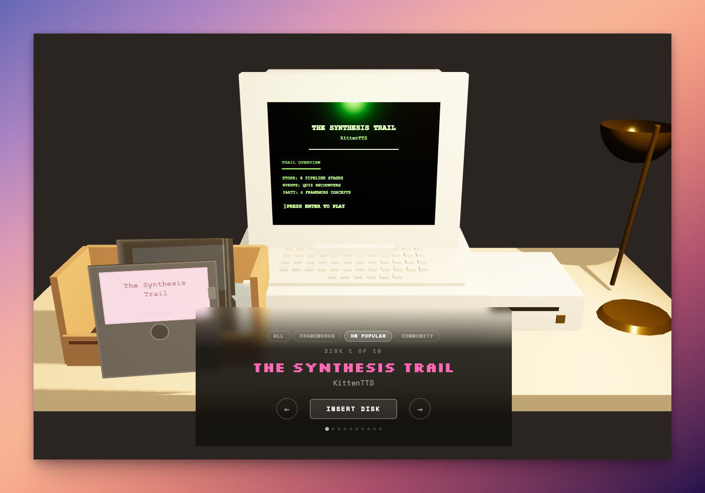
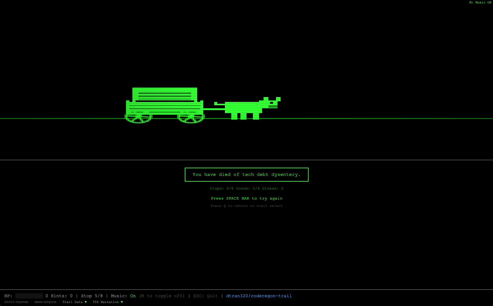

# Coderegon Trail

Learn codebases by playing Oregon Trail. A [Claude Code](https://docs.anthropic.com/en/docs/claude-code) plugin that turns codebases into retro pixel art trail games.

<p align="center">
  
</p>

Travel through ~8 stops representing stages of a project's architecture, answer quiz events disguised as trail decisions, and try to keep your party alive long enough to reach Response Frontier.

<p align="center">
  
</p>

## Play Now

26 games ship ready to play in your browser — no Claude Code required.

**[Play online](https://www.davidtran.me/coderegon-trail/)** or serve locally:

```bash
git clone https://github.com/dtran320/coderegon-trail.git
cd coderegon-trail
python3 -m http.server 8080
# visit http://localhost:8080
```

| Game | Trail Name | Source |
|------|------------|--------|
| [recursive](recursive/) | The Recursive Trail | [dtran320/coderegon-trail](https://github.com/dtran320/coderegon-trail) |
| [gstack](gstack/) | The Software Factory Trail | [garrytan/gstack](https://github.com/garrytan/gstack) |
| [openclaw](openclaw/) | The Gateway Trail | [openclaw/openclaw](https://github.com/openclaw/openclaw) |
| [rails](rails/) | The Convention Trail | [rails/rails](https://github.com/rails/rails) |
| [django](django/) | The WSGI Wagon Trail | [django/django](https://github.com/django/django) |
| [express](express/) | The Middleware Prairie | [expressjs/express](https://github.com/expressjs/express) |
| [react](react/) | The Component Canyon | [facebook/react](https://github.com/facebook/react) |
| [laravel](laravel/) | The Artisan Trail | [laravel/laravel](https://github.com/laravel/laravel) |
| [cmux](cmux/) | The Terminal Trail | [manaflow-ai/cmux](https://github.com/manaflow-ai/cmux) |
| [craftplan](craftplan/) | The Production Trail | [puemos/craftplan](https://github.com/puemos/craftplan) |
| [ferrite](ferrite/) | The Rendering Trail | [OlaProeis/Ferrite](https://github.com/OlaProeis/Ferrite) |
| [gotreesitter](gotreesitter/) | The Parser Trail | [odvcencio/gotreesitter](https://github.com/odvcencio/gotreesitter) |
| [kittentts](kittentts/) | The Synthesis Trail | [KittenML/KittenTTS](https://github.com/KittenML/KittenTTS) |
| [korb](korb/) | The Checkout Trail | [yannick-cw/korb](https://github.com/yannick-cw/korb) |
| [localgpt](localgpt/) | The Inference Trail | [localgpt-app/localgpt](https://github.com/localgpt-app/localgpt) |
| [mini-browser](mini-browser/) | The Layout Trail | [beginner-jhj/mini_browser](https://github.com/beginner-jhj/mini_browser) |
| [minidiffusion](minidiffusion/) | The Diffusion Trail | [yousef-rafat/miniDiffusion](https://github.com/yousef-rafat/miniDiffusion) |
| [moongate](moongate/) | The Packet Trail | [moongate-community/moongatev2](https://github.com/moongate-community/moongatev2) |
| [nanochat](nanochat/) | The Transformer Trail | [karpathy/nanochat](https://github.com/karpathy/nanochat) |
| [pg-textsearch](pg-textsearch/) | The Relevance Trail | [timescale/pg_textsearch](https://github.com/timescale/pg_textsearch) |
| [pi-mono](pi-mono/) | The Agent Loop Trail | [badlogic/pi-mono](https://github.com/badlogic/pi-mono) |
| [qmd](qmd/) | The Hybrid Search Trail | [tobi/qmd](https://github.com/tobi/qmd) |
| [ruview](ruview/) | The WiFi Sensing Trail | [ruvnet/RuView](https://github.com/ruvnet/RuView) |
| [shannon](shannon/) | The Exploit Trail | [KeygraphHQ/shannon](https://github.com/KeygraphHQ/shannon) |
| [spacetimedb](spacetimedb/) | The Spacetime Trail | [clockworklabs/SpacetimeDB](https://github.com/clockworklabs/SpacetimeDB) |
| [superpowers](superpowers/) | The Superpowers Trail | [obra/superpowers](https://github.com/obra/superpowers) |

## How It Works

Each game is a self-contained HTML file that defines `TRAIL_DATA` (stops, code snippets, quiz events) and loads the shared `engine.js` for rendering, state management, audio, and UI. No build step, no bundler, no framework.

**Game loop:** Title screen -> party setup (4 members = key concepts) -> travel between stops -> quiz events between stops (weather, river crossings, encounters, misfortunes, fortunes) -> arrive at Response Frontier to win, or die of tech debt dysentery trying.

**Game features:**
- Canvas parallax landscape with pixel art wagon and oxen
- Code snippets with Shiki syntax highlighting at each stop
- 5 event types with different damage/reward mechanics
- Party of 4 members representing key project concepts
- Health, supplies, streak bonuses, and scoring systems
- Apple II floppy disk sound effects
- Keyboard controls (1/2/3 for choices, H for hints, Enter to continue)

## Built With

- **[Three.js](https://threejs.org/)** — 3D hub page with an Apple IIe desk scene, CRT monitor with scanlines and phosphorescent glow, and a floppy disk carousel with insertion animations
- **Canvas** — all pixel art is procedural (wagon, oxen, mountains, trees, clouds drawn from `fillRect`/`arc` primitives, no sprite sheets), with 5-layer parallax scrolling
- **Raw Web Audio API** — square wave melody + triangle wave bass at 110 BPM, and procedurally synthesized floppy disk sounds (mechanical slide, latch click, stepper motor seeks, drive hum) — no audio samples or libraries
- **[Shiki](https://shiki.style/)** — syntax highlighting for code snippets at trail stops, with a regex fallback

## Generate Trails with Claude Code

Install as a Claude Code plugin to generate trails for any codebase or PR:

```bash
claude plugin add /path/to/coderegon-trail
```

Then in Claude Code:

```
/fly-visual next          # Next.js App Router Trail
/fly-visual rails         # Rails Convention Trail
/fly-visual django        # Django WSGI Wagon Trail
/fly-visual express       # Express Middleware Prairie
/fly-visual react         # React/Vite Component Canyon
/fly-visual laravel       # Laravel Artisan Trail
/fly-visual openclaw      # OpenClaw Gateway Trail
/fly-visual               # auto-detect from current repo
```

**PR mode** — turn a pull request into a trail:

```
/fly-visual pr 123        # PR #123 becomes the trail
/fly-visual pr main..feat # branch comparison
```

## Testing & Auditing

```bash
node tests/validate-trails.js      # validate trail data structure (3083 checks)
node tests/test-scoring.js         # test gameplay scoring logic (35 tests)
node scripts/audit-trails.js       # extract all Q&A for human review
node scripts/audit-trails.js --json # machine-readable output
node scripts/check-staleness.js    # check if upstream repos have newer commits
```

## Architecture

```
engine.js          Shared game engine (rendering, state, canvas, audio, Shiki, UI)
<game>/index.html  Per-game HTML (TRAIL_DATA + overrides, loads engine.js)
index.html         Hub page — 3D desk scene with floppy disk selector
commands/          CLI commands (markdown specs)
agents/            Claude-powered analysis agents
skills/            Game generation + narration guidelines
scripts/           Shell infrastructure (TTS, config, audit tools)
tests/             Trail validation and scoring tests
config/            Default configuration
```

## Other Skills

This plugin also includes TTS-narrated code review tools:

### Diff Review (`/diff-review`)

Walk through a PR or diff with TTS narration, ranked by importance:

```
/diff-review              # uncommitted changes
/diff-review 123          # GitHub PR #123
/diff-review main..feat   # branch comparison
/diff-review --team       # multi-voice team mode
```

### Walkthrough (`/walkthrough`)

Explore an unfamiliar codebase with a guided TTS-narrated tour:

```
/walkthrough              # full repo tour
/walkthrough src/api      # scoped to a directory
/walkthrough --team       # multi-voice team mode
```

### Navigation

Both TTS commands support interactive navigation during playback:

| Command | Action |
|---------|--------|
| `next` / `prev` | Navigate sections |
| `detail` | Deep dive into current section |
| `fly` | Code fly-through with auto-advancing snippets |
| `question <text>` | Ask about current section |
| `done` | End with summary |

### TTS Engines

Default TTS uses the macOS `say` command. Optional alternatives:

```bash
# OpenAI TTS
export DIFF_REVIEW_TTS_ENGINE=openai
export OPENAI_API_KEY=sk-...

# ElevenLabs TTS
export DIFF_REVIEW_TTS_ENGINE=elevenlabs
export ELEVENLABS_API_KEY=...
```

## Contributing

See [CONTRIBUTING.md](CONTRIBUTING.md) for guidelines.

## Disclaimer

The Oregon Trail is a registered trademark with a [long history of ownership](https://www.reddit.com/r/k12sysadmin/comments/1127qtc/comment/j8lh6rd/) including MECC, The Learning Company, Houghton Mifflin Harcourt, and HarperCollins. This project is not affiliated with or endorsed by any of the trademark holders.

## License

[MIT](LICENSE)
